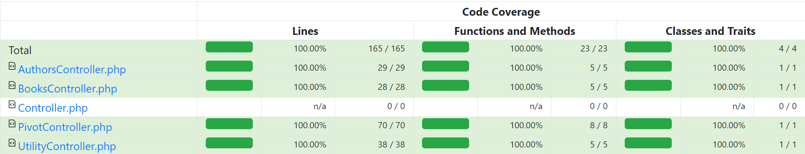
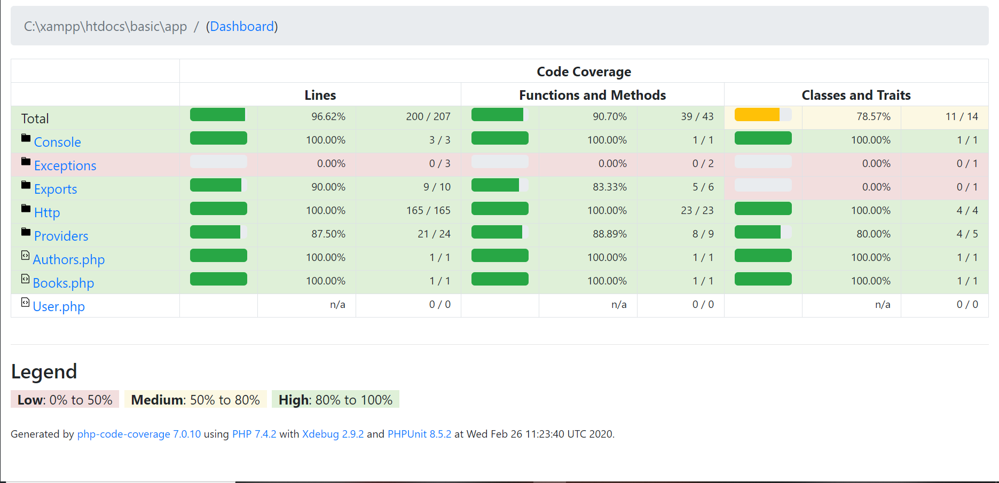

# About the Project:
This project is built with:
1. Backend : PHP Laravel
2. Database : MySQL
3. Frontend : React.js

# How to deploy: 
## On local device:
1. Clone this project to your xampp/htdocs directory (or anywhere you can run a PHP Laravel project in).
2. Open terminal and `cd` to this project directory. 
3. Run `composer install` to install backend dependencies.
4. Run `npm install` to install frontend dependencies.
5. Run `php artisan key:generate` to generate `APP_KEY` in the `.env` file.
6. Add in `.env` file with the configurations shown below to the project folder.
7. Run `php artisan migrate`.
8. (Optional) Run `npm run watch` in case you've changed anything in the frontend.
8. Run `php artisan serve`.
9. In the terminal, it will respond with : `Laravel development server started: [link] ` click on the link to run the web-app on your brower.

## On the cloud servers: 
1. Clone or fork this project. 
2. Open terminal and `cd` to this project directory.
3. Run  `php artisan key:generate` to generate `APP_KEY` in the `.env` file.
4. Add in `.env` configurations as shown below to the cloud server and to the project folder.
5. Run  `php artisan migrate`. 
6. Deploy to your desired hosting services, not forgetting to include the Procfile (it has been included in this project) to specify the server and where to serve the website.

*Note*:
1. *Click on **Guide Me** to learn how to use the web-app*
2. *Please open the web-app with Google Chrome.*

### .env configurations (for *Local Device Deployment* / *Test Coverage*):
```
APP_DEBUG = true
APP_ENV = local 
APP_KEY =  (to be generated through php artisan key:generate)
APP_NAME = LARAVEL
APP_URL=http://127.0.0.1:[port number]


DB_CONNECTION = mysql
DB_DATABASE = ...
DB_HOST = ...
DB_PASSWORD = ...
DB_USERNAME = ...
DB_PORT =   ...
```
### .env configurations (for *Cloud Server Deployment*):
```
APP_DEBUG = true
APP_ENV =  production
APP_KEY = (to be generated through php artisan key:generate)
APP_NAME = LARAVEL
APP_URL= ...


DB_CONNECTION = mysql
DB_DATABASE = ...
DB_HOST = ...
DB_PASSWORD = ...
DB_USERNAME = ...
DB_PORT =   (optional)
```
*Note: for .env, replace  "..." with __suitable configurations__.*

# To run *Code Coverage Test* : 
1. Clone this project to your xampp/htdocs directory (or anywhere you can run a PHP Laravel project in).
2. Open your terminal and `cd` to this project directory.
3. Run `composer install` to install backend dependencies.
4. Run `npm install` to install frontend dependencies.
5. Run  `php artisan key:generate` to generate `APP_KEY` in the `.env` file.
6. Add in `.env` configurations as shown above to the project folder. __IMPORTANT: Do not use your live/production database for testing, as all data in database will be deleted once the test runs.__
7. Run `vendor/bin/phpunit`. Note that:
    1. *This will take about 5 minutes to run.*
    2. __This will overwrite all files in the reports folder.__
8. Go to *reports* folder and open *index.html* file in your browser to view the test coverage report. _The functions written for this project are in:_
    1. _Mostly at_ [HTTP/Controllers](report/Http/Controllers/index.html).
    2. _And the rest is at_ 
        1. [Exports](report/Exports/index.html).
        2. [Authors Model](report/Authors.php.html).
        3. [Books Model](report/Books.php.html).

_[Report Overview](report/index.html)_

# More information on: 
1. [XML export methodology](documentation/XMLExport.md)
2. [Database Structure Diagram](documentation/DBStructure.md)