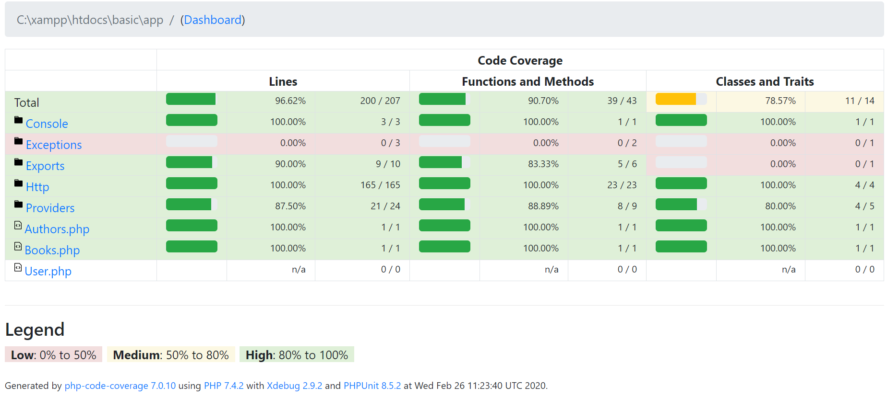

# About the Project:
This project is built with:
1. Backend : PHP Laravel
2. Database : MySQL
3. Frontend : React.js

# How to deploy: 
## On local device:
1. Clone this project to your xampp/htdocs directory (or anywhere you can run a PHP Laravel project in).
2. Open terminal and `cd` to this project directory. 
3. Run `composer install` to install backend dependencies.  
4. In the root directory of the project folder, create a `.env` file with the configuration shown below.
5. Run `php artisan migrate`.
6. (Optional) Run `npm install` and then `npm run watch` in case you've changed anything in the frontend.
7. Run `php artisan config:cache`.
8. Run `php artisan serve`.
9. In the terminal, it will respond with : `Laravel development server started: [link] ` click on the link to run the web-app on your brower.

## On the cloud servers: 
1. Follow [how to deploy on your local device](#on-local-device) until step 7.
2. Deploy to your desired hosting services, not forgetting to include the _Procfile_ (it has been included in this project) to specify the server type.

*Note*:
1. *Click on **Guide Me** to learn how to use the web-app*
2. *Please open the web-app with Google Chrome.*

### .env configurations (for *Local Device Deployment* / *Code Coverage Test*):
```
APP_DEBUG = true
APP_ENV = local 
APP_KEY =  (generated through "php artisan key:generate --show")
APP_NAME = LARAVEL
APP_URL=http://127.0.0.1:[port number]


DB_CONNECTION = mysql
DB_DATABASE = ...
DB_HOST = ...
DB_PASSWORD = ...
DB_USERNAME = ...
DB_PORT =   ...
```
### .env configurations (for *Cloud Server Deployment*):
```
APP_DEBUG = true
APP_ENV =  production
APP_KEY = (generated through "php artisan key:generate --show")
APP_NAME = LARAVEL
APP_URL= ...


DB_CONNECTION = mysql
DB_DATABASE = ...
DB_HOST = ...
DB_PASSWORD = ...
DB_USERNAME = ...
DB_PORT =   (optional)
```
*Note: for .env, replace  "..." with __suitable database/hosting configurations__.*

# To run *Code Coverage Test* : 
1. Follow [how to deploy on your local device ](#on-local-device) until step 7.  __IMPORTANT: Do not use your live/production database for testing, as all data in database will be deleted once the test runs.__
2. Run `vendor/bin/phpunit`. Note that:
    1. *This will take about 5 minutes to run.*
    2. __This will overwrite all files in the reports folder.__
3. Go to *reports* folder and open *index.html* file in your browser to view the test coverage report. 

_[Report Overview](report/index.html)_

# More information on: 
1. [XML export methodology](documentation/XMLExport.md)
2. [Database Structure Diagram](documentation/DBStructure.md)
3. [Report : which one matters? ](documentation/AboutReport.md)


_Content Disclaimer:_ The book titles and author names filled in this repository are fictitious. Any resemblance to any person living or dead, or any book titles, is entirely coincidental.